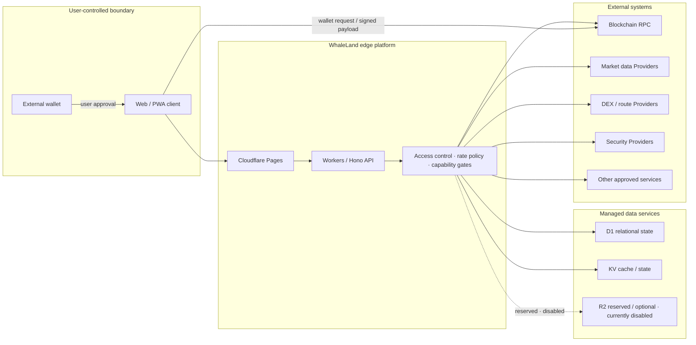
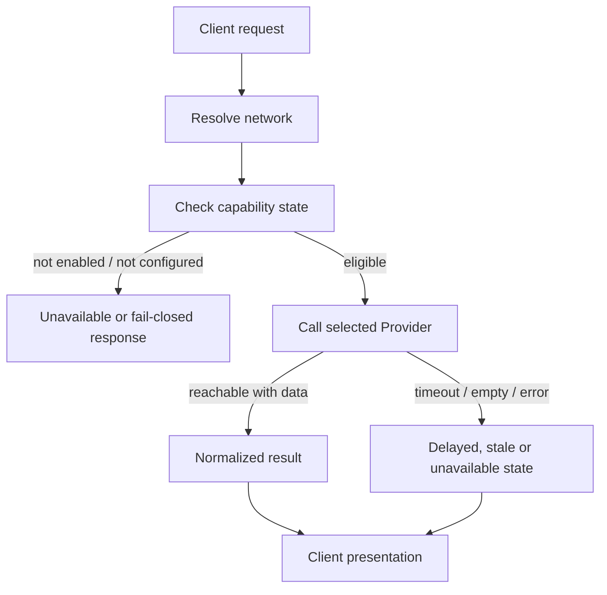

# Public Architecture Overview

This document explains WhaleLand Swap at a system-boundary level. It deliberately omits implementation code, database schema, internal endpoints, infrastructure identifiers and production configuration.

## High-Level System

## Responsibility Boundaries

| Layer | Public responsibility description |
| --- | --- |
| Client | Product UI, input validation, state presentation and wallet-request initiation |
| Wallet | Private-key custody, user approval and signature creation under the wallet's own controls |
| Pages | Static delivery and edge entry point |
| Workers / Hono | API composition, policy enforcement, Provider orchestration and truthful error states |
| D1 / KV | Managed application data and caching in the active production configuration |
| Cloudflare R2 | Reserved / optional object storage capability; currently disabled in the active production configuration |
| Providers | Chain access, market data, routes, security signals and approved external services |

## Capability-Gated Requests

The platform does not treat network registration or adapter presence as proof that a live capability is ready. Implementation, configuration, reachability and data availability are evaluated separately.

## External-Wallet Transaction Boundary

1. The application prepares or requests a route based on the selected network and current Provider state.
2. The client presents the intended action to the user.
3. For an external-wallet path, the user's wallet performs its own approval and signing flow.
4. Submission and receipt state are tracked separately from UI intent.
5. Missing receipts, rejected signatures or unavailable Providers must not be represented as completed execution.

Separately gated signing and operational services can have different trust and authorization boundaries. Their implementation and controls are intentionally outside this public showcase.

## Intentionally Omitted

- Worker and Hono implementation
- Chain execution and wallet-signing implementation
- Swap, AMM, Launch and settlement algorithms
- Internal Admin architecture details
- Database tables, migrations and seed data
- Provider endpoints and production account identifiers
- Credentials, secret names and secret values
- Deployment commands and runnable infrastructure configuration
