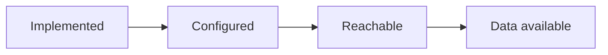

# Network & Capability Model

WhaleLand Swap uses a capability matrix so that a registered network is not automatically presented as fully enabled.

## Registered Networks

| Ecosystem | Network |
| --- | --- |
| EVM | Ethereum |
| EVM | BNB Smart Chain |
| EVM | Base |
| EVM | Arbitrum One |
| EVM | Polygon |
| EVM | Avalanche C-Chain |
| EVM | opBNB |
| EVM | Robinhood Chain |
| EVM | ENI Mainnet |
| Solana | Solana |

## Capability Dimensions

| Capability | What it represents |
| --- | --- |
| `market` | Discoverable market and token data |
| `rpc` | Chain read/write connectivity appropriate to the operation |
| `wallet` | Supported wallet connection and authorization path |
| `swap` | Quote, route and transaction-preparation availability |
| `bridge` | Explicit supported direction, assets and Provider route |
| `pool` | Pool discovery or creation capability for the selected network |
| `launch` | Token-launch lifecycle support for the selected network |
| `holders` | Holder-distribution data from a supported source |
| `security` | Contract or token risk signals from a supported source |

Historical price / K-line data is tracked independently from general market data because a current quote does not prove that candle history is available.

Bridge availability is route-specific and directional; a registered network does not imply general cross-chain bridging.

## State Model

Each state answers a different question:

- **Implemented** — does a code path or adapter exist?
- **Configured** — are the required deployment settings present?
- **Reachable** — has the current runtime observed a successful Provider connection?
- **Data available** — has the Provider returned usable data for this capability?

The last two states may be unknown until a real request is observed. Unknown is not converted to enabled.

## Public Interpretation

- Network registration means that the platform recognizes the network.
- An enabled market surface does not imply Swap, Pool, Bridge or Launch availability.
- A wallet adapter does not prove that a route or Provider is configured.
- Provider failure may produce delayed, stale or unavailable states.
- External-wallet transaction completion requires wallet authorization and an accepted execution result.

Live capability state can change with Provider health and production configuration. This document intentionally avoids publishing infrastructure configuration or promising universal availability.
