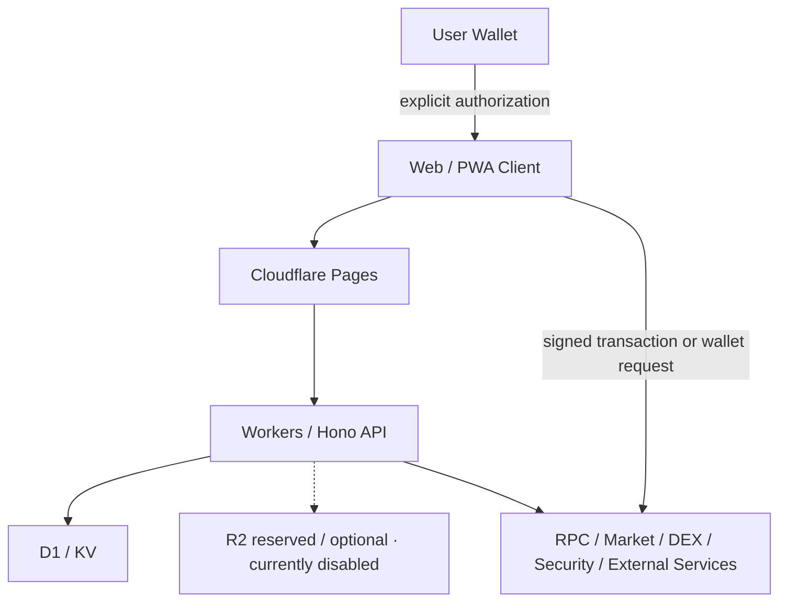
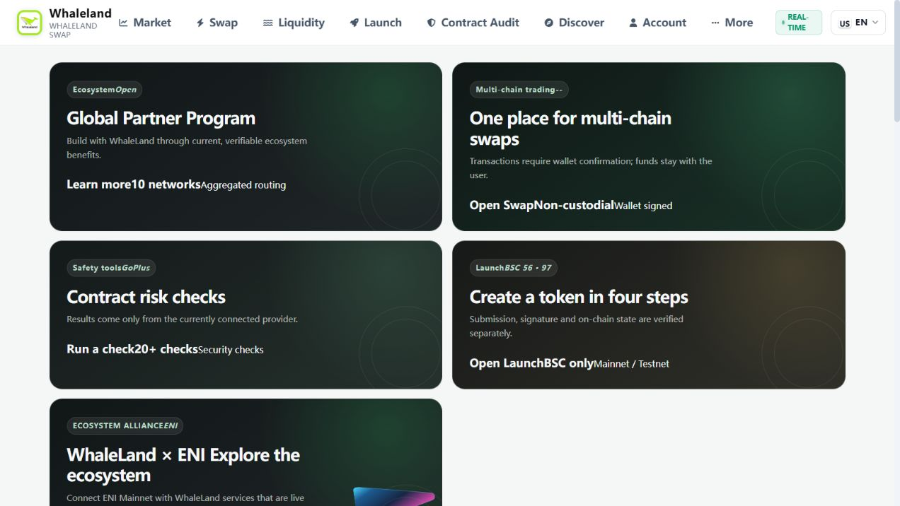
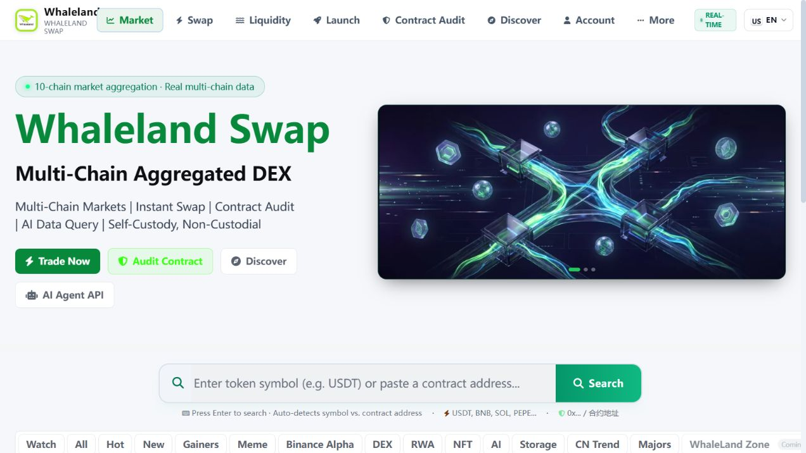
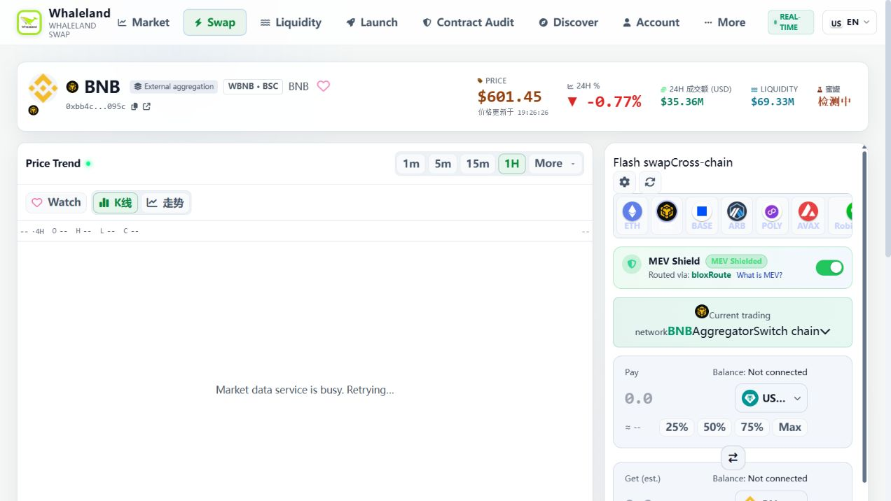
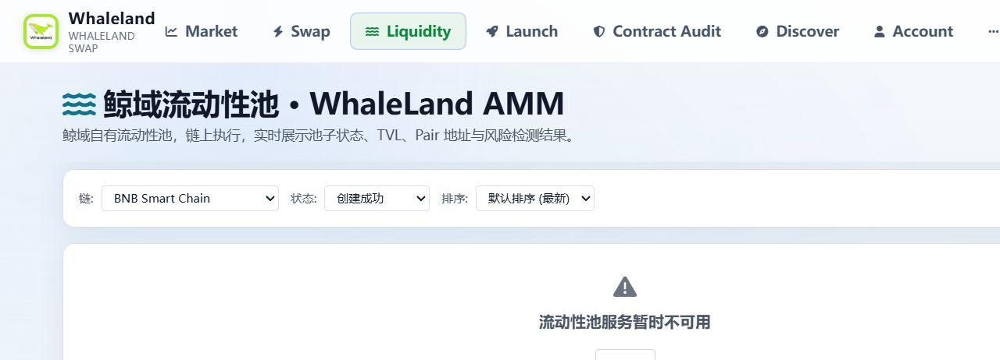
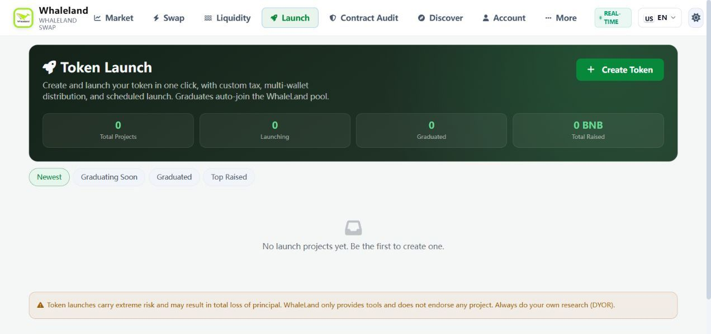
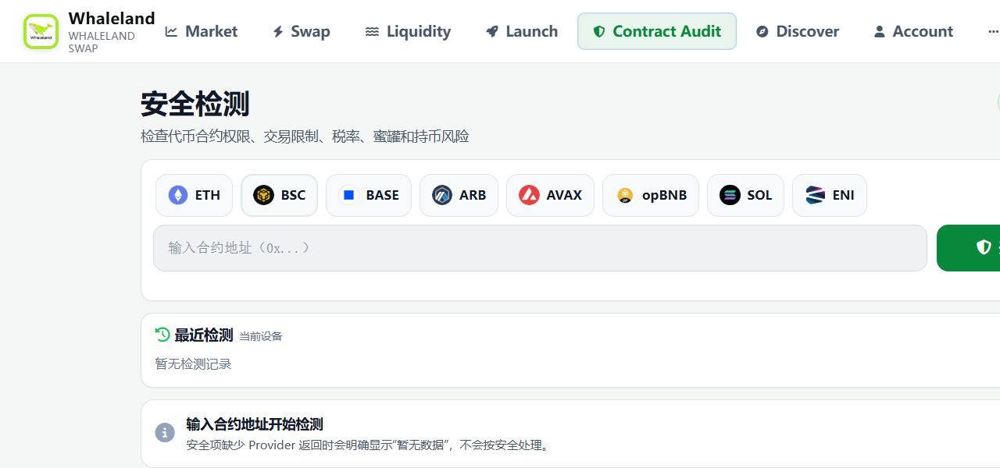
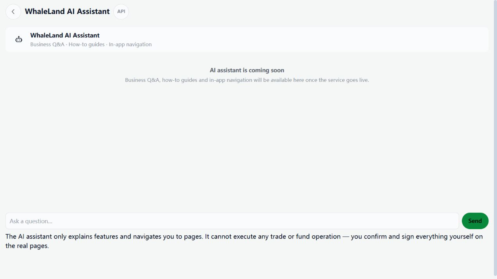

# WhaleLand Swap · 鲸域交换

> Non-custodial multi-chain Web3 trading and on-chain infrastructure platform.

> 非托管多链 Web3 交易与链上基础设施平台，覆盖 DEX 聚合、链上数据、Pool / Launch、Wallet、AI Agent 与平台运营能力。

[GitHub Profile](https://github.com/goosun-io) · [Architecture](./ARCHITECTURE.md) · [Capabilities](./CAPABILITIES.md) · [API Overview](./API-OVERVIEW.md) · [Security](./SECURITY.md)

## Project Overview

WhaleLand Swap is a non-custodial Web3 product and infrastructure platform designed around multi-chain discovery, wallet-confirmed trading, on-chain data, token launch, liquidity pools and operational tooling.

鲸域交换以多链资产发现、钱包确认交易、链上数据、代币发行、流动性池及平台运营为核心。平台提供交易和数据界面，不托管用户私钥；具体网络与能力是否可用，由独立能力状态和当前 Provider 状态决定。

This repository is a **public showcase only**. It contains product documentation and selected screenshots, not the commercial source code or a deployable distribution.

## Core Capabilities

| Area | Product capability |
| --- | --- |
| Multi-chain Data | Cross-network market discovery, token metadata, price history and provider-aware data states |
| DEX / Swap | Aggregated quotes, route preparation and wallet-confirmed execution |
| Chain & Pools | Network registry, capability gating, liquidity discovery and on-chain pool states |
| Launchpad | Token launch flows, project lifecycle views and explicit network restrictions |
| Wallet Integration | EVM and ecosystem-specific wallet adapters with user-controlled authorization |
| Chain Execution | Transaction preparation, execution-state tracking and receipt-aware outcomes |
| Contract Risk Detection | Provider-backed token and contract risk signals with unavailable states shown explicitly |
| Discover | Market, ecosystem, news and product discovery surfaces |
| Community | Community content, governance-oriented modules and engagement surfaces |
| Benefits | Points, tasks, memberships and benefit presentation modules |
| API Gateway | Access control, plans, usage governance and productized API surfaces |
| AI Agent | Data/query and transaction-preparation integration boundaries; execution remains user-authorized |
| Admin & Operations | Separate operational control surfaces, content operations, analytics and security controls |

Capability descriptions indicate platform scope, not a promise that every Provider, network or transaction path is enabled at all times.

## Engineering Scale

| Metric | Showcase inventory snapshot |
| --- | ---: |
| API endpoints | **513** |
| API domains / categories | **34** |
| API source files | **43** |

These figures describe an internal engineering inventory snapshot. They are scale indicators, not a stable public API contract. No endpoint implementation is included here.

## Supported Networks

The current network registry covers:

- Ethereum
- BNB Smart Chain
- Base
- Arbitrum One
- Polygon
- Avalanche C-Chain
- opBNB
- Solana
- Robinhood Chain
- ENI Mainnet

> **Network registered ≠ all capabilities enabled.**

Each network is evaluated independently for `market`, `rpc`, `wallet`, `swap`, `bridge`, `pool`, `launch`, `holders` and `security`. Historical price data / K-line capability is also tracked independently. Implementation, configuration, reachability and real data availability are separate states; an adapter or registry entry alone does not prove production readiness.

See [CAPABILITIES.md](./CAPABILITIES.md) for the conceptual model.

## Architecture

The diagram intentionally omits internal endpoints, credentials, schemas, settlement logic and production configuration. A more detailed public boundary view is available in [ARCHITECTURE.md](./ARCHITECTURE.md).

## Security & Non-Custodial Model

- User private keys are not included in this repository and are not intended to be stored by the platform.
- On-chain transactions require explicit wallet authorization; the interface does not replace wallet confirmation.
- Wallet, signer, application and Admin permissions have separate trust boundaries.
- API surfaces use access-control and usage-governance layers appropriate to their role.
- Sensitive configuration belongs in managed runtime secret storage, never in this showcase.
- Provider failures, missing configuration and unverified data should fail closed or be shown as unavailable rather than fabricated.

This is a boundary description, not an absolute security guarantee. See [SECURITY.md](./SECURITY.md).

## CI/CD & Engineering

The commercial project demonstrates:

- GitHub Actions pull-request validation
- Type checking, linting, unit tests and production builds
- Preview-oriented validation workflows
- Exact-source production deployment controls
- Controlled D1 migration workflows
- Scheduled catalog / maintenance jobs

Workflow descriptions are included at a capability level only. Production credentials, account identifiers and runnable deployment configuration are intentionally excluded.

## Screenshots

Screenshots were generated from a clean local build of the current product source without signing in, connecting a wallet or loading private account data. Provider-dependent unavailable states are retained where present.

### Product Home

### Multi-chain Markets

### Swap & Token Detail

### Liquidity Pools

### Token Launch

### Contract Risk Detection

### AI Assistant Boundary

Admin dashboard imagery is deliberately excluded from this public package because operational accounts, permissions and business data require a stricter disclosure review.

## Technology Stack

- TypeScript across edge and application layers
- Hono-based API composition
- Cloudflare Pages and Workers
- D1 and KV managed data capabilities
- Cloudflare R2 reserved / optional object storage capability, currently disabled in the active production configuration
- Vite build pipeline
- Tailwind CSS and product-specific UI systems
- EVM and Solana wallet integration boundaries
- Market, DEX, RPC and contract-risk Provider integrations

Technology names describe the architecture; this showcase contains no vendored runtime, lockfile or deployable application bundle.

## Links

- GitHub Profile: [goosun-io](https://github.com/goosun-io)
- Goosun / WhaleLand contact: [@goosun_io](https://t.me/goosun_io)

The private commercial source repository is intentionally not linked for cloning.

## Commercial / Technical Cooperation

Cooperation areas include:

- Web3 Platform Development
- DEX / Swap Integration
- Token Launch / Launchpad
- Multi-chain Infrastructure
- AI Agent Integration
- API Platform
- Custom Software Development

For technical or commercial enquiries, contact the current Goosun / WhaleLand profile through the links above. No pricing is published in this showcase.

## Public-Repository Boundary

This package is intentionally non-runnable. It does not include application source, smart-contract source, database schemas, migrations, package manifests, environment templates, deployment workflows or production configuration. Cloning this directory cannot produce a complete WhaleLand deployment.

Copyright © 2026 WhaleLand Labs INC. All rights reserved. See [LICENSE.md](./LICENSE.md).
