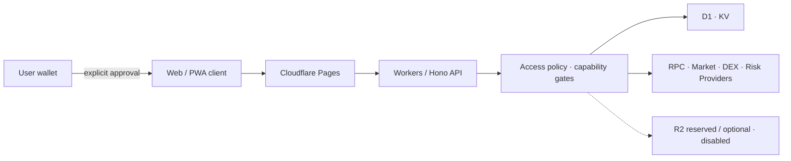

# WhaleLand Swap

> A multi-chain Web3 platform combining non-custodial external-wallet trading, on-chain intelligence, developer APIs, launch infrastructure, liquidity, contract-risk signals, and AI-assisted workflows.

`Multi-chain` · `DEX Aggregation` · `On-chain Data` · `Launchpad` · `Liquidity` · `Contract Risk` · `AI Agent` · `Developer API`

[Architecture](./ARCHITECTURE.md) · [Network Capabilities](./CAPABILITIES.md) · [Developer Platform](./API-OVERVIEW.md) · [Security](./SECURITY.md) · [GitHub Profile](https://github.com/goosun-io)

WhaleLand brings market discovery, transaction preparation, liquidity tooling, token-launch workflows, and risk intelligence into one provider-aware product surface. In external-wallet trading flows, users retain control of their private keys and authorize signing through their wallet.

This repository is a **public product and technical showcase of a proprietary commercial platform**. It contains documentation and selected product screenshots, not application source code or a deployable distribution.

## Why WhaleLand

| Strength | What it means |
| --- | --- |
| Capability-aware multi-chain architecture | Network registration is separated from live capability readiness, so unsupported operations are not presented as universally available. |
| Provider-aware data states | Market, route, history, holder, and risk data can be represented as available, delayed, stale, unconfigured, or unavailable instead of being fabricated. |
| Wallet-authorized trading | External-wallet trading flows leave approval and signing with the user. Prepared, submitted, and confirmed states remain distinct. |
| Integrated Web3 workflows | Market intelligence, Swap, Pools, Launch, contract-risk signals, and wallet state share a coherent product and platform boundary. |
| Developer platform | API domains cover market and token data, multi-chain state, routing, liquidity, launch, risk, execution state, AI-assisted workflows, and platform operations. |
| Edge-first delivery | The application and API architecture uses Cloudflare Pages, Workers, Hono, D1, and KV with provider orchestration at the edge. |

## Product Capabilities

### Trading & Liquidity

- Multi-chain market discovery and DEX quote aggregation
- Route and transaction preparation for supported network paths
- Swap, pool discovery, and liquidity-state workflows
- User-authorized external-wallet execution with separate submission and receipt states

### Market & On-chain Intelligence

- Token discovery, metadata, current market data, and historical data where available
- Holder and chain data from supported providers
- Provider-aware availability and degradation states
- Cross-network capability checks before dependent operations

### Launch Infrastructure

- Token-launch and project lifecycle surfaces
- Network-specific capability controls
- Separate preparation, signature, submission, and on-chain result states

### Contract Risk

- Provider-backed contract and token risk signals
- Network-aware security capability checks
- Explicit unavailable or incomplete states when evidence cannot be obtained

### Wallet & Execution

- EVM and Solana wallet integration boundaries
- User-controlled private keys and wallet approval in external-wallet flows
- Transaction preparation and receipt-aware tracking
- Separately gated signing or operational services are outside this public showcase boundary

### AI-assisted Workflows

The AI surface connects product guidance, search and query, market intelligence, and transaction-preparation workflows when the relevant service is available. The assistant is read-only and Provider-dependent; agent interfaces support data, preparation, and post-broadcast tracking rather than autonomous signing or trading.

## Product Experience

These Desktop screenshots were captured without signing in, connecting a wallet, or loading private account data. The selection prioritizes clear product surfaces; Provider-unavailable and not-yet-live pages are intentionally omitted from the README.

### Desktop

| Product Home | Multi-chain Markets |
| --- | --- |
|  |  |

| Token Launch | Contract Risk |
| --- | --- |
|  |  |

No Admin or operations imagery is published because account, permission, analytics, billing, and business data require a stricter disclosure boundary.

## Developer Platform

WhaleLand's platform interfaces are organized around product capabilities rather than a single undifferentiated endpoint list:

| Domain | Developer capability |
| --- | --- |
| Market & Token Data | Discovery, metadata, prices, history, holder data, and normalized availability states |
| Multi-chain Data | Network registry, chain state, capability resolution, and cross-chain status |
| DEX Quotes & Routing | Quote discovery, route preparation, and execution-state separation |
| Pools & Launch | Liquidity discovery, pool state, token launch, and lifecycle status |
| Contract Risk | Provider-backed token and contract signals with explicit degraded states |
| Wallet & Execution State | Wallet connection boundaries, transaction preparation, submission, and receipt tracking |
| AI-assisted APIs | Search, query, market intelligence, guidance, and preparation-oriented integration |
| Platform APIs | Account, access control, analytics, content, notifications, and operational boundaries |

Current static inspection identifies **500+ internal API handlers across 40+ API modules**. These figures are an engineering snapshot, not a claim that 500+ APIs are publicly available or a stable public API contract.

See [API-OVERVIEW.md](./API-OVERVIEW.md) for the public domain inventory, design principles, and disclosure limits.

## Multi-chain Architecture

The current registry recognizes 10 networks across EVM and Solana ecosystems:

`Ethereum` · `BNB Smart Chain` · `Base` · `Arbitrum One` · `Polygon` · `Avalanche C-Chain` · `opBNB` · `Robinhood Chain` · `ENI Mainnet` · `Solana`

> **Registered does not mean every capability is enabled.**

Each network is evaluated independently for `market`, `rpc`, `wallet`, `swap`, `bridge`, `pool`, `launch`, `holders`, and `security`. Historical price data is tracked independently from current market data. Implementation, configuration, Provider reachability, and real data availability are separate states.

See [CAPABILITIES.md](./CAPABILITIES.md) for the capability and state model.

## Security & Non-Custodial Boundary

- External-wallet trading flows leave private-key custody, approval, and signing with the user's wallet.
- WhaleLand may prepare external-wallet requests or transactions but does not replace wallet confirmation.
- AI-assisted interfaces provide read, preparation, and tracking boundaries rather than autonomous signing or trading.
- Missing Provider evidence is surfaced as unavailable or degraded rather than replaced with invented prices, risk results, or receipts.
- User, wallet, API, Provider, and Admin permissions are separate trust zones.
- Sensitive configuration belongs in managed runtime secret storage and is excluded from this repository.

This is a system-boundary description, not an absolute security guarantee. See [SECURITY.md](./SECURITY.md).

## Global Edge Infrastructure

WhaleLand is designed around edge-delivered application and API infrastructure with globally distributed request handling.

Cloudflare R2 remains a reserved, optional capability and is **currently disabled in the active production configuration**. Architecture details intentionally exclude account identifiers, internal hostnames, Provider URLs, operational dashboards, traffic data, and deployment configuration.

See [ARCHITECTURE.md](./ARCHITECTURE.md) for the public system-boundary view.

## Engineering Snapshot

| Metric | Current public snapshot |
| --- | ---: |
| Internal API handlers | **500+** |
| API modules | **40+** |
| Registered networks | **10** |

These are engineering-scale indicators, not public API commitments, performance claims, or guarantees of live capability availability.

## Technology

`TypeScript` · `Hono` · `Cloudflare Pages` · `Cloudflare Workers` · `D1` · `KV` · `Vite` · `Tailwind CSS` · `EVM` · `Solana`

Technology names describe the commercial platform architecture. This showcase contains no runtime source, package manifest, lockfile, infrastructure configuration, or deployment workflow.

## Documentation

| Document | Purpose |
| --- | --- |
| [ARCHITECTURE.md](./ARCHITECTURE.md) | Public system boundaries, capability gating, and transaction flow |
| [CAPABILITIES.md](./CAPABILITIES.md) | Registered networks and the capability-state model |
| [API-OVERVIEW.md](./API-OVERVIEW.md) | Developer platform domains, principles, and public limits |
| [SECURITY.md](./SECURITY.md) | Non-custodial, trust-zone, and repository disclosure boundaries |
| [LICENSE.md](./LICENSE.md) | Copyright and legal usage boundary |

## Commercial & Technical Cooperation

WhaleLand is available for technical and commercial discussions involving Web3 platforms, DEX and Swap integration, token-launch infrastructure, multi-chain systems, AI-assisted workflows, developer APIs, and custom software delivery.

Contact [@goosun_io](https://t.me/goosun_io) or visit the [goosun-io GitHub profile](https://github.com/goosun-io). Pricing and private commercial details are not published in this showcase.

## Public Repository Boundary

This package is intentionally non-runnable. It does not include application or Worker source, smart-contract source, database schemas, migrations, environment files, package manifests, internal endpoints, Provider configuration, algorithms, settlement logic, deployment commands, or production infrastructure identifiers.

Copyright © 2026 WhaleLand Labs INC. All rights reserved. See [LICENSE.md](./LICENSE.md).
